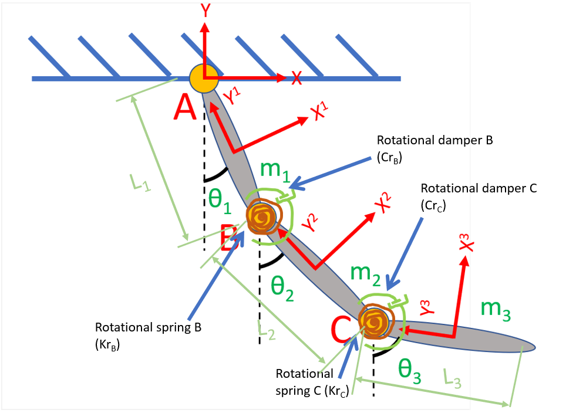

# Model Derivation — Triple Pendulum (paper work *before* the code)

> This is the "do the math on paper first" worksheet for **this exact repo's
> model**. It is the companion to `NOTES.md`: where `NOTES.md` explains the
> general theory, this file applies it step-by-step to the specific 3-link
> system until every symbol has a concrete expression you can transcribe into
> Python. Section numbers in brackets like [§4] point back to `NOTES.md`.
>
> Workflow captured here:
> **sketch → coordinates → body points → constraints → Jacobian (by hand)
> → quadratic-velocity vector → mass matrix → forces → augmented EOM
> → solve plan → map symbols to code.**

---

## The destination: the augmented equation of motion

Everything in this worksheet exists to fill in **one matrix equation** — the
cardinal equation of constrained multibody dynamics (the *augmented* form).
Solve it at each instant for the accelerations `q̈` and the Lagrange
multipliers `λ`:

```math
\begin{bmatrix} M & C_q^{\mathsf T} \\ C_q & 0 \end{bmatrix}
\begin{bmatrix} \ddot{q} \\ \lambda \end{bmatrix}
=
\begin{bmatrix} Q_e \\ Q_d \end{bmatrix}
```

Read it as: *(top row)* Newton's law with the joint reaction forces `C_qᵀλ`
added; *(bottom row)* the requirement that accelerations keep the joints
satisfied (`C_q q̈ = Q_d`). Two unknown blocks, two equation blocks.

Every step below is just **producing one of these ingredients** for our specific
3-link model:

| Block | What it is | Comes from |
|---|---|---|
| `M` | mass / inertia matrix | Step 7 |
| `C_q` | constraint Jacobian | Step 5 |
| `Q_e` | applied generalized forces (gravity, springs, dampers) | Step 8 |
| `Q_d` | quadratic-velocity vector (the `C_q q̈ = Q_d` right side) | Step 6 |
| `q̈`, `λ` | **the unknowns** — accelerations & reaction multipliers | Step 9 solve |

For our model the assembled system is **15×15** (`n + nc = 9 + 6`). Keep this
target in view: each section is handing you one piece of it. Steps 1–4 build the
scaffolding (`q`, points, constraints) the ingredients depend on; Steps 5–8 are
the ingredients themselves; Step 9 assembles and solves; Steps 10–11 wrap it in
time integration and code.

---

## Step 0 — Sketch and inventory the system

The model that the rest of this derivation is built on:



*Joints A (pin to ground), B and C (revolute, each with a torsional spring `Kr`
and rotational damper `Cr`); body-fixed frames `XⁱYⁱ`; angles `θᵢ` from the
vertical; lengths `Lᵢ`; masses `mᵢ`. Every symbol below maps to this figure.*

Text schematic of the same thing:

```
            ┌── ground (fixed point, world origin O)
            ●  A          ← pin joint A (link1 ↔ ground)
            │
            │  link 1     (mass m1, length L1)
            │
            ●  B          ← revolute joint B (link1 ↔ link2)  + torsional spring krB, damper crB
            │
            │  link 2     (mass m2, length L2)
            │
            ●  C          ← revolute joint C (link2 ↔ link3)  + torsional spring krC, damper crC
            │
            │  link 3     (mass m3, length L3)
            │
            ○             ← free end
```

**Inventory:**
- **Bodies:** 3 rigid uniform rods.
- **Joints:** A (pin to ground), B (revolute), C (revolute) → 3 joints.
- **Force elements:** gravity (all bodies); torsional spring + rotational damper at B and at C.
- **Body reference point:** each rod's **center of mass** (mid-length) — chosen so the mass matrix is constant & diagonal (see `NOTES.md` §7 and the COM discussion).

**Expected DOF (sanity check before any math):**
`DOF = 3·(bodies) − (constraint equations)`.
A pin and each revolute supply 2 scalar constraints → `3·3 − 3·2 = 9 − 6 = 3`.
The 3 DOF will be the three link angles `θ₁, θ₂, θ₃`.

---

## Step 1 — Choose generalized coordinates [§1]

Absolute (Cartesian) coordinates, **3 per body** = COM position + orientation:

```math
q = \big[\, \underbrace{R_{x1},R_{y1},\theta_1}_{\text{body 1}},\ \underbrace{R_{x2},R_{y2},\theta_2}_{\text{body 2}},\ \underbrace{R_{x3},R_{y3},\theta_3}_{\text{body 3}} \,\big]^{\mathsf T}, \qquad n = 9
```

Angles `θ_i` measured from the global vertical (world +y), positive CCW.

---

## Step 2 — Locate the body-fixed joint points `ū` [§2]

Each rod's COM is at mid-length, so its two ends are `±L/2` along the body's
local y-axis. List every point that participates in a joint:

| Point | On body | Local vector `ū` | Meaning |
|---|---|---|---|
| A | 1 | `[0,  +L₁/2]` | top end of link 1 (to ground) |
| B | 1 | `[0,  −L₁/2]` | bottom end of link 1 |
| B | 2 | `[0,  +L₂/2]` | top end of link 2 |
| C | 2 | `[0,  −L₂/2]` | bottom end of link 2 |
| C | 3 | `[0,  +L₃/2]` | top end of link 3 |

> ⚠️ **Repo discrepancy to fix on paper vs. code:** in `main_tp.py:59`,
> `u_bar_2C` is coded as `[0, −L₁/2]` (uses L₁), but the correct model value is
> `[0, −L₂/2]`. Harmless while all `L=1`; wrong if `L₂ ≠ L₁`. The math below
> uses the correct `L₂/2`.

Shorthand for the rest of this document: `a = L₁/2`, `b = L₂/2`, `d = L₃/2`,
and `sᵢ = sin θᵢ`, `cᵢ = cos θᵢ`.

---

## Step 3 — Global position of each joint point [§2]

Using `rᵢᴾ = Rᵢ + A(θᵢ) ūᵢᴾ` with
`A(θ) = [[c, −s], [s, c]]`, work out each one (this is the algebra you'd grind on paper):

```math
A(\theta)\begin{bmatrix}0\\ \pm h\end{bmatrix} = \begin{bmatrix} \mp h\, s \\ \pm h\, c \end{bmatrix}
```

| Point | Global position `r` |
|---|---|
| `r₁ᴬ` | `[ R_{x1} − a s₁ ,  R_{y1} + a c₁ ]` |
| `r₁ᴮ` | `[ R_{x1} + a s₁ ,  R_{y1} − a c₁ ]` |
| `r₂ᴮ` | `[ R_{x2} − b s₂ ,  R_{y2} + b c₂ ]` |
| `r₂ᶜ` | `[ R_{x2} + b s₂ ,  R_{y2} − b c₂ ]` |
| `r₃ᶜ` | `[ R_{x3} − d s₃ ,  R_{y3} + d c₃ ]` |

### Why the `ū` vectors are `[0, ±h]` (and other "free" simplifications)

None of these simplifications change the physics — they're **choices of where to
put the body frame**, which is yours to make. Picking them well turns ugly
algebra into the clean form above. The rule of thumb: *the physics is fixed, but
the bookkeeping is yours — spend that freedom before you start differentiating.*

**1. Align the local `Yⁱ` axis along the rod ⇒ `ū = [0, ±h]`.**
We deliberately orient each body-fixed frame so its `Yⁱ` axis runs **down the
length of the linkage**. Then every point of interest (both ends, the COM) lies
on that axis, so its `x_local = 0` and the local vector collapses to just
`[0, ±h]` — a single nonzero number instead of two. That single zero is what
makes `A(θ)ū` reduce to the tidy `[∓h s, ±h c]` template, which in turn makes the
whole Jacobian (Step 5) sparse and hand-derivable. Had we tilted the local frame
arbitrarily, every `ū` would have two nonzero entries and twice the trig.

**2. Put the reference point `R` at the center of mass.**
Free to place anywhere on the body (see `NOTES.md` §-on-anchors), but the COM is
special: it **decouples translation from rotation**, making the mass matrix
constant and diagonal `diag(m, m, J)` (Step 7) with no velocity-dependent inertia
terms. Any other anchor is still valid physics but drags coupling terms into `M`.
For a uniform rod the COM is the geometric mid-point, which is *also* why the two
ends come out as the symmetric `±L/2` — choices (1) and (2) reinforce each other.

**3. Anchor the ground pin at the world origin ⇒ joint A is `r₁ᴬ = 0`.**
We're free to place the inertial frame anywhere; putting `O` exactly at the pin
makes the ground constraint `r₁ᴬ − 0 = 0` instead of `r₁ᴬ − (some constant) = 0`.
The constant vanishes, and so does its contribution to every derivative.

**4. Measure all angles `θᵢ` from the same global vertical.**
Using one common reference axis (not joint-relative angles) keeps each `A(θᵢ)`
independent of the others, so the Jacobian blocks don't chain-multiply. (This is
the absolute-coordinate choice; it trades more coordinates for simpler, decoupled
derivatives — see `NOTES.md` §13.)

**5. Uniform rod ⇒ closed-form inertia `J = mL²/12`.**
Assuming a slender uniform rod lets the moment of inertia be a one-line formula
instead of an integral, and centers it at the mid-point (reinforcing #2).

> The pattern across all five: *exploit the freedoms the formulation gives you
> (frame origin, frame orientation, inertial-frame placement, angle reference)
> to bury as many zeros and constants in the equations as possible — **before**
> you differentiate.* Every zero you place by choice is a term you never have to
> derive, code, or debug.

---

## Step 4 — Write the constraint equations `C(q) = 0` [§3]

### The canonical form first (where every equation below comes from)

Each joint is an instance of one **canonical constraint**. Derive the general
form once, then just substitute the specific bodies/points.

**Revolute (pin) joint — the master equation.** A revolute joint between bodies
`i` and `j` says: *the point P on body i and the point P on body j are the same
point in space.* That's a 2-D vector equation (⇒ 2 scalar constraints):

```math
\boxed{\;C^{rev}_{ij} = r_i^{P} - r_j^{P} = \big(R_i + A(\theta_i)\,\bar u_i^{P}\big) - \big(R_j + A(\theta_j)\,\bar u_j^{P}\big) = \mathbf{0}\;}
```

**Ground (fixed-pin) joint — the special case.** When one of the two bodies is
the inertial frame, its point is just a constant location `c` (no `R`, no `A`),
so the master equation degenerates to:

```math
C^{grd}_{i} = r_i^{P} - c = R_i + A(\theta_i)\,\bar u_i^{P} - c = \mathbf{0}
```

Everything in Step 4 is one of these two. To instantiate, you only plug in:
**(1)** which bodies, **(2)** their local points `ū` (from Step 2), and **(3)**
the `r = R + Aū` expansions (already done in Step 3). The substitution *is* the
derivation — there's no new calculus, just bookkeeping.

> General → specific recipe:
> 1. Write the canonical form for the joint type.
> 2. Replace `rᵢᴾ`, `rⱼᴾ` with their Step-3 expansions.
> 3. Split the 2-D vector equation into its x- and y-rows.

---

The ground pin fixes A to the world origin (`c = O = [0,0]`); each revolute makes
the two coincident points equal. Applying the recipe gives six scalar equations:

**Joint A** = `C^grd₁` with `P = A`, `c = 0` (`r₁ᴬ = 0`):
```math
\begin{aligned}
C_1 &: R_{x1} - a\,s_1 = 0\\
C_2 &: R_{y1} + a\,c_1 = 0
\end{aligned}
```

**Joint B** = `C^rev₁₂` with `P = B` (`r₁ᴮ − r₂ᴮ = 0`):
```math
\begin{aligned}
C_3 &: R_{x1} - R_{x2} + a\,s_1 + b\,s_2 = 0\\
C_4 &: R_{y1} - R_{y2} - a\,c_1 - b\,c_2 = 0
\end{aligned}
```

**Joint C** = `C^rev₂₃` with `P = C` (`r₂ᶜ − r₃ᶜ = 0`):
```math
\begin{aligned}
C_5 &: R_{x2} - R_{x3} + b\,s_2 + d\,s_3 = 0\\
C_6 &: R_{y2} - R_{y3} - b\,c_2 - d\,c_3 = 0
\end{aligned}
```

So `C = [C₁ … C₆]ᵀ`, `nc = 6`. DOF `= 9 − 6 = 3` ✓ (matches Step 0).

> **Sign note for code-matching:** the repo stores joint A as `−r₁ᴬ` rather than
> `+r₁ᴬ` (`constraintModuleTP.py:revolutJoint` / `constraintEquation`). That just
> negates rows 1–2 (and the matching `Q_d`/λ), which is physically identical.
> This worksheet keeps the natural `+` sign; flip rows 1–2 if you want a
> byte-for-byte match.

---

## Step 5 — Derive the Jacobian `C_q` by hand [§4]

`C_q = ∂C/∂q` is **6×9**. Differentiate each `Cᵢ` w.r.t. every coordinate.
Columns ordered `[R_{x1}, R_{y1}, θ₁ | R_{x2}, R_{y2}, θ₂ | R_{x3}, R_{y3}, θ₃]`.

Useful sub-result (this is the `A_θ ū` block from §4):
`∂(A(θ)ū)/∂θ = A_θ(θ) ū`, e.g. `∂r₁ᴬ/∂θ₁ = [−a c₁, −a s₁]`.

```math
C_q=\begin{bmatrix}
1 & 0 & -a c_1 & 0 & 0 & 0 & 0 & 0 & 0\\
0 & 1 & -a s_1 & 0 & 0 & 0 & 0 & 0 & 0\\
1 & 0 &  a c_1 & -1 & 0 & b c_2 & 0 & 0 & 0\\
0 & 1 &  a s_1 & 0 & -1 & b s_2 & 0 & 0 & 0\\
0 & 0 & 0 & 1 & 0 & b c_2 & -1 & 0 & d c_3\\
0 & 0 & 0 & 0 & 1 & b s_2 & 0 & -1 & d s_3
\end{bmatrix}
```

This is the matrix `constraintModuleTP.py:jacobianMatrix` builds block-by-block.
Each `±I₂` is a translation block; each trig column is a `±A_θ(θ) ū` block.

**Partition into dependent / independent [§4]:** pick the 3 angles as
independent. Then:
- `C_{q_i}` = columns `{θ₁, θ₂, θ₃}` (cols 3, 6, 9) → **6×3**
- `C_{q_d}` = the other 6 columns (the Cartesian `R`'s) → **6×6** (must be invertible)

```math
C_{q_d}=\begin{bmatrix}
1&0&0&0&0&0\\0&1&0&0&0&0\\
1&0&-1&0&0&0\\0&1&0&-1&0&0\\
0&0&1&0&-1&0\\0&0&0&1&0&-1
\end{bmatrix},\qquad
C_{q_i}=\begin{bmatrix}
-a c_1 & 0 & 0\\
-a s_1 & 0 & 0\\
 a c_1 & b c_2 & 0\\
 a s_1 & b s_2 & 0\\
 0 & b c_2 & d c_3\\
 0 & b s_2 & d s_3
\end{bmatrix}
```

(Note `C_{q_d}` is constant — a nice property of choosing the Cartesian coords as
dependent.)

---

## Step 6 — Velocity & acceleration kinematics; derive `Q_d` [§5–6]

**Velocity** (differentiate `C=0` once): `C_q q̇ = 0`, so
`q̇_d = −C_{q_d}⁻¹ C_{q_i} q̇_i`.

**Acceleration** (differentiate again): `C_q q̈ = Q_d`, with the
quadratic-velocity vector built from the `A_θθ = −A` identity [§6]. For each joint
`Q_d = θ̇ᵢ² A(θᵢ) ūᵢ − θ̇ⱼ² A(θⱼ) ūⱼ` (single body for A). Plugging the points:

```math
\begin{aligned}
Q_d^{A} &= \dot\theta_1^{\,2}\,[\,-a s_1,\ a c_1\,]\\
Q_d^{B} &= \dot\theta_1^{\,2}\,[\,a s_1,\ -a c_1\,] - \dot\theta_2^{\,2}\,[\,-b s_2,\ b c_2\,]\\
Q_d^{C} &= \dot\theta_2^{\,2}\,[\,b s_2,\ -b c_2\,] - \dot\theta_3^{\,2}\,[\,-d s_3,\ d c_3\,]
\end{aligned}
```

Stack: `Q_d = [Q_d^A ; Q_d^B ; Q_d^C]` (6×1). Each entry is a centripetal
`ω²·(rotated arm)` term — no `θ̈` appears. → `QdCalc1`, `QdCalc2`.

---

## Step 7 — Mass matrix `M` [§7]

COM coordinates ⇒ translation/rotation decouple ⇒ constant diagonal **9×9**:

```math
M = \mathrm{diag}(\,m_1, m_1, J_1,\ m_2, m_2, J_2,\ m_3, m_3, J_3\,),
\qquad J_i = \tfrac{1}{12} m_i L_i^2
```

→ `massMatrix`, `inertiaRod`.

---

## Step 8 — Generalized forces `Q_e` (9×1) [§8]

Start at zero, then add each effect into the right slot.

**Gravity** → into the `R_y` slots only (force at COM, no torque):
```math
Q_e^{(R_{y1})} = -m_1 g,\quad Q_e^{(R_{y2})} = -m_2 g,\quad Q_e^{(R_{y3})} = -m_3 g
```

**Torsional springs + rotational dampers** → into the `θ` slots. With rest angle
`θ₀ = 0`, joint B couples (1,2) and joint C couples (2,3):
```math
\begin{aligned}
Q_e^{(\theta_1)} &= -k_{rB}(\theta_1-\theta_2) - c_{rB}(\dot\theta_1-\dot\theta_2)\\
Q_e^{(\theta_2)} &= +k_{rB}(\theta_1-\theta_2) - k_{rC}(\theta_2-\theta_3) + c_{rB}(\dot\theta_1-\dot\theta_2) - c_{rC}(\dot\theta_2-\dot\theta_3)\\
Q_e^{(\theta_3)} &= +k_{rC}(\theta_2-\theta_3) + c_{rC}(\dot\theta_2-\dot\theta_3)
\end{aligned}
```

The middle link gets contributions from **both** joints (the `±` reaction pairs).
All other entries of `Q_e` are 0. → `forceModule.torSpring`, `forceModule.torDamp`,
assembled in `systemEquation`.

---

## Step 9 — Assemble the augmented equation of motion [§7]

Combine dynamics (`M q̈ + C_qᵀ λ = Q_e`) with acceleration constraints
(`C_q q̈ = Q_d`) into one **(n+nc) × (n+nc) = 15×15** linear system:

```math
\begin{bmatrix} M & C_q^{\mathsf T} \\ C_q & 0 \end{bmatrix}
\begin{bmatrix} \ddot q \\ \lambda \end{bmatrix}
=
\begin{bmatrix} Q_e \\ Q_d \end{bmatrix}
```

Solve at each instant for the 9 accelerations `q̈` and 6 multipliers `λ`.
Joint reaction forces follow from `Q_c = −C_qᵀ λ` [§9]. → `systemEquation`.

---

## Step 10 — Solution plan (what the time loop must do) [§5, §10–11]

Only `θ₁, θ₂, θ₃` (and their rates) are integrated; everything else is recovered
from the constraints each step. On paper, decide this order *before* coding:

1. **Position:** given the independent angles, Newton–Raphson on
   `C_{q_d} Δq_d = −C` until `‖Δq_d‖ < ε` → dependent Cartesian positions.
2. **Velocity:** `q̇_d = −C_{q_d}⁻¹ C_{q_i} q̇_i` (one linear solve).
3. **Acceleration / forces:** solve the 15×15 augmented system → `q̈`, `λ`.
4. **Integrate:** advance `[θ, θ̇]` to `t+Δt` with RK4 (re-form `C_q` at each stage).
5. Repeat.

Initial conditions: set `θ₁,θ₂,θ₃` (here `π/4, π/3, π/2`), velocities 0; run one
position analysis to get a consistent starting configuration.

---

## Step 11 — Map every symbol to code (the transcription table)

This is the final paper-to-Python step: each derived object becomes one
function or array.

| Paper object (this file) | Code |
|---|---|
| `q` layout, `link→index` map | `link2index` (`calcModuleTP.py`) |
| `A(θ)`, `A_θ(θ)` | `ATransformMatrix`, `ATransformMatrixTHETA` |
| `r = R + Aū` (Step 3) | `local2global` |
| `ū` joint points (Step 2) | `u_bar_*` globals (`main_tp.py:56–60`) |
| Constraints `C` (Step 4) | `constraintEquation`, `revolutJoint` |
| Jacobian `C_q`, partitions (Step 5) | `jacobianMatrix` |
| Newton–Raphson position (Step 10.1) | `positionAnalysis` |
| Velocity solve (Step 10.2) | `Cdi` block in `mainProg` |
| `Q_d` (Step 6) | `QdCalc1`, `QdCalc2` |
| `M`, `Jᵢ` (Step 7) | `massMatrix`, `inertiaRod` |
| `Q_e` gravity/spring/damper (Step 8) | `systemEquation`, `forceModule` |
| Augmented 15×15 solve (Step 9) | `systemEquation` |
| Reactions `−C_qᵀλ` | `FReact_allTime` in `mainProg` |
| RK4 (Step 10.4) | `rungeKutta4_AtTimeNow` |

---

## The method in one breath

> Sketch the system and count DOF → pick coordinates → locate body-fixed points
> → turn each joint into algebraic constraints → differentiate them by hand for
> the Jacobian → differentiate twice for `Q_d` → write down `M` and `Q_e` →
> stack everything into the augmented matrix → decide the per-step solve order →
> and only then translate each symbol into a function. The code is the *last*
> step, not the first — exactly the order you did it in.
